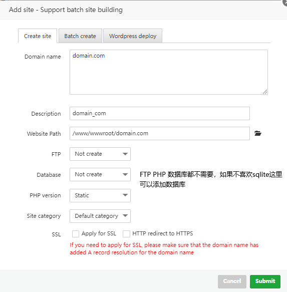
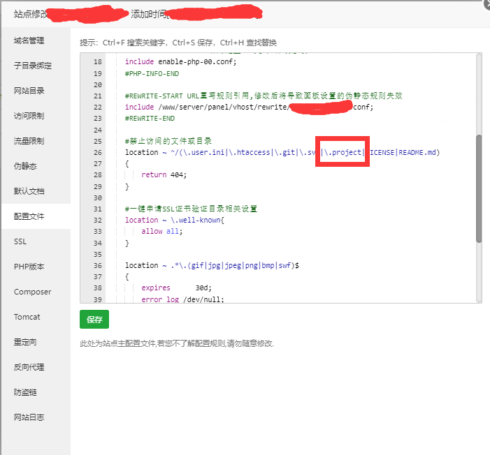

本文档基于宝塔环境进行部署

# ！！！无论是不是用宝塔部署，在把整个项目放到网站目录时，一定要把`.project`目录排除在外，该目录是flask运行目录，保存了一些包括钱包在内的重要数据及配置，请务必不要暴露在外

# 准备工作
    1.安装宝塔
    2.安装nginx，为请求提供静态资源及反向代理
    3.安装Python Manager插件，用于python虚拟环境的创建及flask项目的运行
    4.创建trongrid账号，在后台获取免费的API密钥 https://www.trongrid.io/register


# 步骤
## 1.创建网站
\
## 2.配置nginx

### 将以下代码复制到nginx配置文件的server块中
#### 注意`http://127.0.0.1:5001`后不应该加`/`，否则反代后的url会把api路径去掉
#### 5001为flask启动的端口号，如果和其他应用冲突了自行更换修改
```angular2html
location ^~ /api/
{
    proxy_pass http://127.0.0.1:5001;
    proxy_set_header Host $host;
    proxy_set_header X-Real-IP $remote_addr;
    proxy_set_header X-Forwarded-For $proxy_add_x_forwarded_for;
    proxy_set_header REMOTE-HOST $remote_addr;
    proxy_set_header Upgrade $http_upgrade;
    proxy_set_header Connection $connection_upgrade;
    proxy_http_version 1.1;
    # proxy_hide_header Upgrade;

    add_header X-Cache $upstream_cache_status;
}
```


### 确保nginx配置文件里面将.project排除在外，如果没有则自行添加
```angular2html
    location ~ ^/(\.user.ini|\.htaccess|\.git|\.svn|\.project|LICENSE|README.md)
    {
        return 404;
    }
```


## 2.下载项目
打开终端进入你的网站目录后输入以下命令下载该项目
```
进入你的网站目录
git clone https://github.com/yuimoi/mousdt
cd mousdt
mv static ../
mv page ../
mv .project ../
cd ..
rm -rf mousdt
```


### 下载完成后网站目录应该是这样的


## 3.创建环境运行项目
### 1.在Python项目管理器中的版本管理安装python3.7
### 2.添加项目

### 3.若项目运行失败则查看日志错误信息


## 4.生成账号密码
### 进入`.project`目录执行下面命令修改管理员账号密码
#### 将`[venv的python环境]`替换成`.project`目录下的`[一大串MD5]_venv`文件目录
```angular2html
[venv的python环境]/bin/python3 -m flask admin --username 你的账号 --password 你的密码
```
#### 例子
```angular2html
/www/wwwroot/baidu.com/.project/767f69883dccd72f0110653567dcac59_venv/bin/bin/python3 -m flask admin --username OvOusername --password QAQpassword
```

## 5.生成账号密码
后台地址为`你的域名/page/admin/`或者`你的域名/page/admin/index.html`，如果报错500则说明nginx没有启动，如果报错404则说明项目没有下载或者路径不对，具体参考第2步下载项目


## 6.登录后台
### 在设置选项中填入获取的trongrid密钥，之后在交易选项中测试api是否可用


# 常见问题
### Python项目管理器日志报错：
#### 1.permmission denied 
    创建项目的时候应该选择root用户
#### 2.TypeError: __init__() got an unexpected keyword argument 'unbound_message'
    flask版本太高，检查requirements.txt的flask版本

### 后台登录时报404：
    若为nginx的404，则反向代理没有配置成功
    若为flask的404，则反向代理配置错误，有可能是端口后加了斜杠
    

